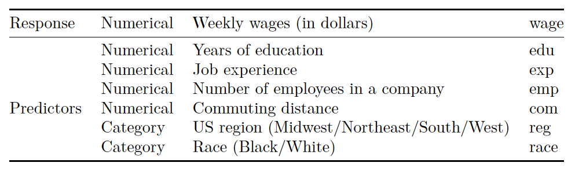
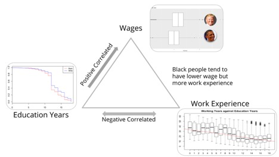
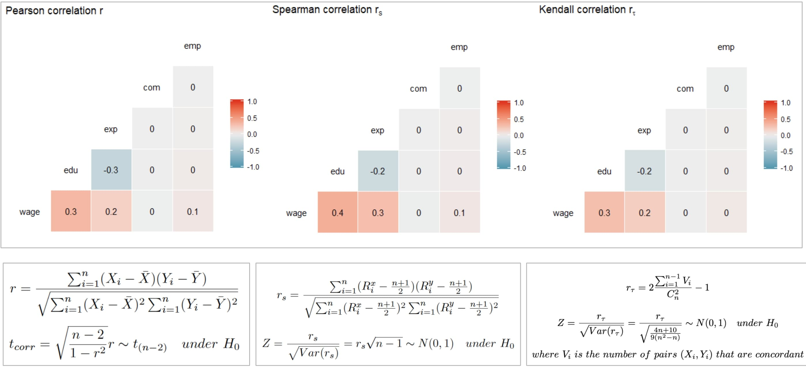

# Wage difference Between Black & White People

## [Project Description](doc/project_instruction.pdf)

Term: Fall 2019

+ Group 11
+ Team members

	+ Chen Chen cc4291@columbia.edu
	+ Sixing Hao sh3799@columbia.edu
	+ Wenwen Shen ws2561@columbia.edu
	+ Yuting He yh3054@columbia.edu
	+ Yang Meng ym2696@columbia.edu

## Introduction
The goal of our final project is to study the wage difference between Black and White People and the reason behind it.

The data is roughly about 25,000 records of people between the ages of 18 and 70, and the data are taken many decades ago so the wages are lower compared to current times.

This is how our dataset looks like:

<p align="center">
  
</p>


We were required to find some insights and bring them to the table with this dataset, especially, we were asked to utilize some nonparametric methods learnt in the class.

* Correlation Comparison
<p align="center">

</p>

* Conclusion Slide
<p align="center">

</p>

Following [suggestions](http://nicercode.github.io/blog/2013-04-05-projects/) by [RICH FITZJOHN](http://nicercode.github.io/about/#Team) (@richfitz). This folder is orgarnized as follows.

```
proj/
├── data/
├── code/
├── figs/
└── output/
```
